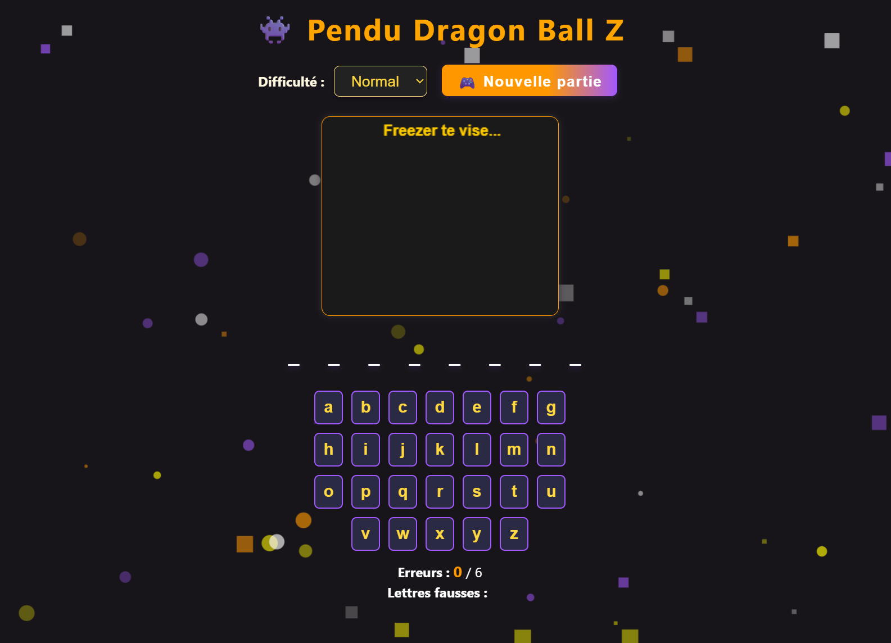

# 🐉 Pendu Dragon Ball Z

Jeu du pendu sur le thème Dragon Ball Z, avec dessin animé sur canvas (Freezer), niveaux de difficulté, fond animé stylé grâce à [particles.js](https://vincentgarreau.com/particles.js/), et design moderne !

---

## ✨ Fonctionnalités

- 🔸 **Plusieurs niveaux de difficulté** (Facile, Normal, Difficile)
- 🧠 **Mots 100% Dragon Ball Z** (personnages, attaques, concepts)
- 🎨 **Canvas personnalisé : Freezer** en version pendu, yeux rouges à la dernière erreur
- ⚡ **Fond animé** dynamique façon énergie DBZ (particles.js)
- 🔄 **Bouton Nouvelle partie** pour relancer rapidement
- 🎹 **Jeu 100% au clavier physique**
- 📱 **Responsive non optimisé** : fonctionne sur mobile/tablette/PC mais mal optimisé, à régler plus tard
- 🇫🇷 **En français**

---

## 📷 Aperçu



---

## 🚀 Installation & utilisation

1. **Clone ou télécharge ce repo :**

    ```bash
    git clone https://github.com/Vili-Dev/dragon-ball-z-pendu.git
    cd pendu-dbz
    ```

2. **Place les fichiers nécessaires :**
   - `index.html`
   - `style.css`
   - `script.js`
   - `particles.js`
   - `particles.json`
   - Un dossier `images` pour éventuellement tes aperçus ou captures d’écran.

3. **Ouvre `index.html` dans ton navigateur** (clic, ou avec [Live Server](https://marketplace.visualstudio.com/items?itemName=ritwickdey.LiveServer) sur VSCode).

---

## 🧩 Structure du projet
```
📦 pendu-dbz
├── index.html
├── style.css
├── script.js
├── particles.js
├── particles.json
├── images/
│ └── preview.png
```

---

## 🔧 Personnalisation

- Change les mots DBZ dans `script.js` pour rajouter tes persos/attaques préférés
- Modifie la config du fond animé dans `particles.json` (couleurs, vitesse, etc)
- Personnalise le dessin sur canvas (`dessinerPendu` dans le JS)

---

## 🧑‍💻 Auteur

Projet par [Vili](https://github.com/Vili-Dev)  
Crédits visuels et inspiration à Akira Toriyama et l’univers Dragon Ball

---

## 📄 Licence

Ce projet est open-source sous licence MIT.

---